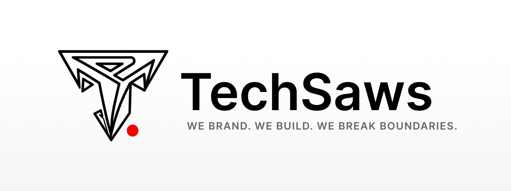

# TechSaws

### We Build. We Brand. We Break Boundaries.

TechSaws is a systems engineering studio focused on AI automation, backend infrastructure, and scalable software systems for modern businesses.

We design and build:

* AI-powered systems
* Backend & cloud infrastructure
* SaaS platforms
* Internal tools & operational systems
* Revenue & growth automation
* Security-focused architectures

Our work combines automation, engineering, and business execution to help companies reduce operational friction, improve scalability, and move faster.

## Core Focus Areas

* AI & Automation Systems
* Backend & Infrastructure Engineering
* Revenue & Growth Systems
* Cybersecurity & System Hardening
* SaaS Architecture
* Cloud & DevOps Engineering

## Technology

```txt
Next.js • TypeScript • Node.js • Python • PostgreSQL
Docker • Kubernetes • AWS • GCP • Redis • Prisma
AI Systems • Automation • APIs • System Design
```

## Philosophy

We build systems that are:

* scalable
* maintainable
* secure
* performance-focused
* designed for real-world execution

## Connect

* GitHub: https://github.com/techsaws
* LinkedIn: https://www.linkedin.com/company/techsaws
* X/Twitter: https://twitter.com/TechSaws
* Website: https://techsaws.com

## Contact

📩 [info@techsaws.com](mailto:info@techsaws.com)
